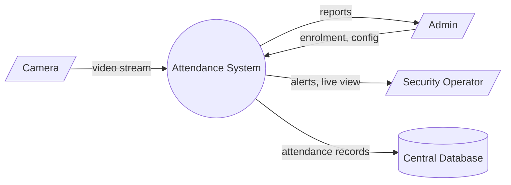
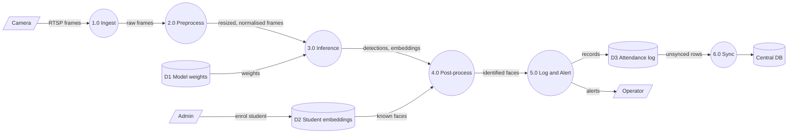

# Task 3: Data-Flow Diagrams

## Level 0 (context)

```mermaid
flowchart LR
    CAM[/Camera/] -->|video stream| SYS((Attendance System))
    ADM[/Admin/] -->|enrolment, config| SYS
    SYS -->|reports| ADM
    SYS -->|alerts, live view| OP[/Security Operator/]
    SYS -->|attendance records| DB[(Central Database)]
```

## Level 1

```mermaid
flowchart LR
    CAM[/Camera/] -->|RTSP frames| P1((1.0 Ingest))
    P1 -->|raw frames| P2((2.0 Preprocess))
    P2 -->|resized, normalised frames| P3((3.0 Inference))
    D1[(D1 Model weights)] -->|weights| P3
    P3 -->|detections, embeddings| P4((4.0 Post-process))
    D2[(D2 Student embeddings)] -->|known faces| P4
    P4 -->|identified faces| P5((5.0 Log and Alert))
    P5 -->|records| D3[(D3 Attendance log)]
    P5 -->|alerts| OP[/Operator/]
    D3 -->|unsynced rows| P6((6.0 Sync))
    P6 --> DB[(Central DB)]
    ADM[/Admin/] -->|enrol student| D2
```
